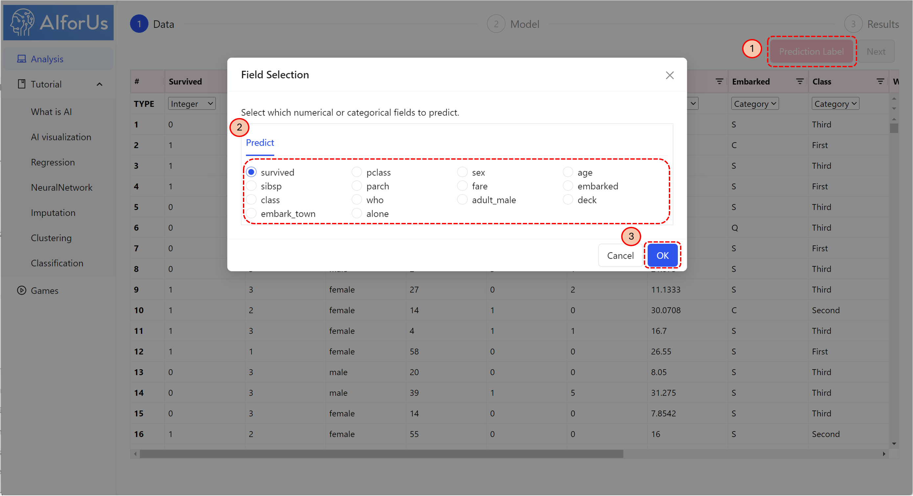
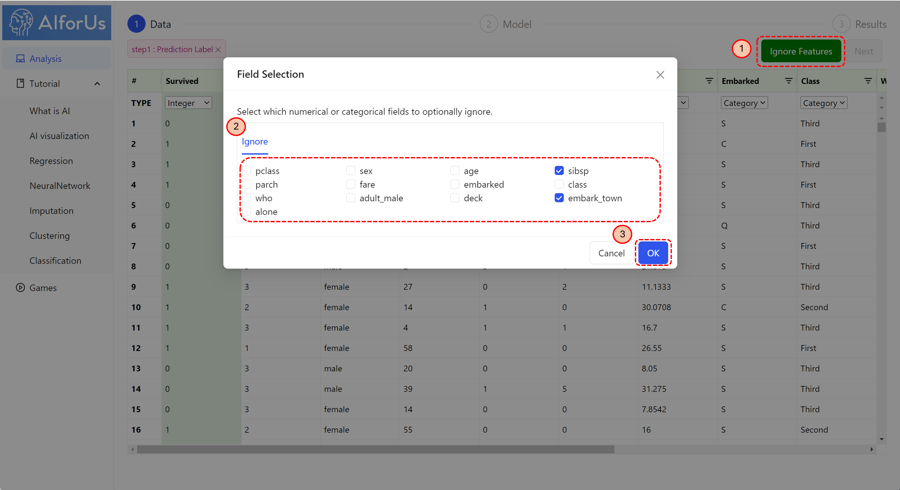
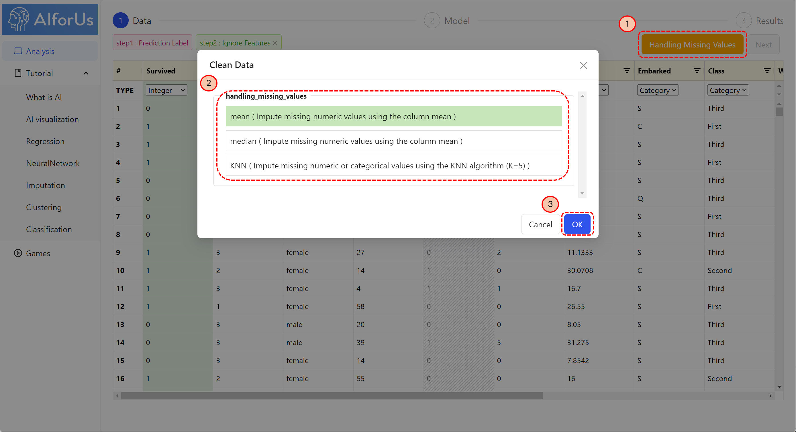
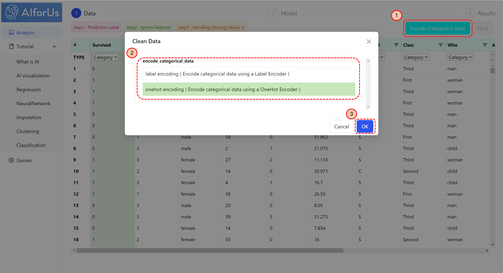
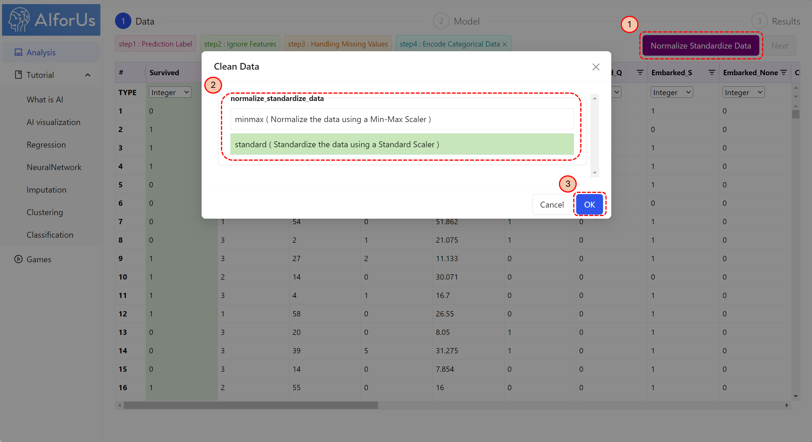
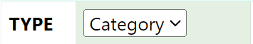
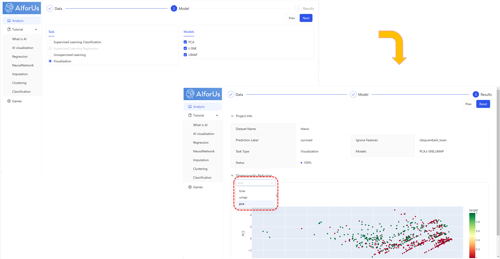
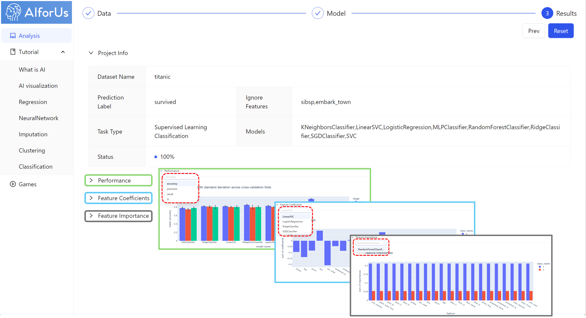
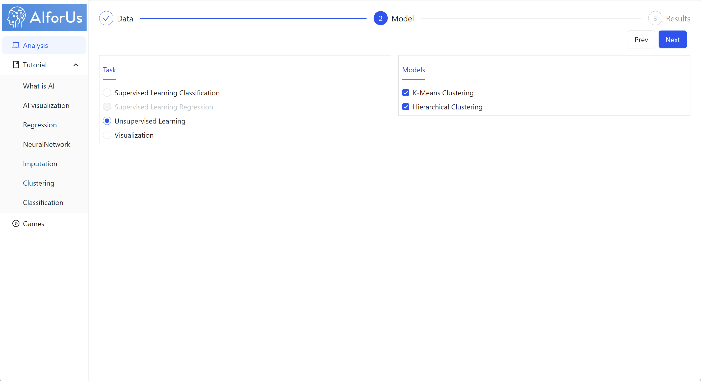

# Data Module

## Upload and organize data

For hands-on practice, you can directly select any one of the available Public Datasets, or, you can upload your own datasets in CSV format.

1.  Click "New Dataset" button.

    <figure><figcaption>
My Datasets
</figcaption></figure>

1.
2. In the pop-up window, enter the dataset name you prefer and upload your dataset.

## Data processing tasks

After selecting an appropriate dataset, we move to the _Data_ section.

Let’s use the Titanic dataset as an example. We provide five key steps for data processing:

1.  Identify Prediction Label.&#x20;

    For example, we choose "survived" as prediction label, shown as image below.

    <figure><figcaption>
Prediction label
</figcaption></figure>
2.  Select Ignore Features.&#x20;

    You can select any features you would like to ignore.

    <figure><figcaption>
Ignore Features
</figcaption></figure>
3.  Handle Missing Values.

    There are 3 different ways to handle missing values — Mean, median and KNN (K-nearest neighbors), you can select based on your own needs.

    <figure><figcaption>
Handle Missing Values
</figcaption></figure>
4.  Encode Categorical Data.&#x20;

    For all the categorical data, you can encode them by 2 options — label encoding and onehot encoding, as shown below.

    <figure><figcaption>
Encode Categorical Data
</figcaption></figure>
5.  Normalize Standardize Data.

    You can choose to use either minmax or standard method to normalize your data.

    <figure><figcaption>
Normalize Standardize Data
</figcaption></figure>

<mark style="color:red;">**Note:**</mark>

In this case, "survived" is a categorical label, so you want to make sure the "TYPE" of this feature is "Category". You can achieve this by selecting "Category" in the dropdown list under "survived" .

At any time, you can return to the previous step and adjust your selections.

After all the data processing tasks, you can now proceed to the _Model_ section by simply clicking "Next" button.

## Visualize data

In the _Model_ section, you can choose to visualize your data using one of three major models—PCA, t-SNE, and UMAP (highlighted in the red dashed rectangle). See image below:

<figure><figcaption>
Visualize data
</figcaption></figure>

## Implement supervised/unsupervised learning

### Supervised learning

We offer various supervised learning models, see the image below:

<figure><figcaption>
Supervised learning models
</figcaption></figure>

After selecting your preferred models, you can proceed to the _Results_ section, where you can see the details of Performance, Feature Coefficients and Feature Importance.

<figure><figcaption>
Supervised learning results
</figcaption></figure>

### Unsupervised learning

We also offer various unsupervised learning models, see the image below:

<figure><figcaption>
Unsupervised learning models
</figcaption></figure>

Similarly, after selecting your preferred models, you can proceed to the _Results_ section, where you can see the clustering details.

<figure><figcaption>
Unsupervised learning results
</figcaption></figure>
