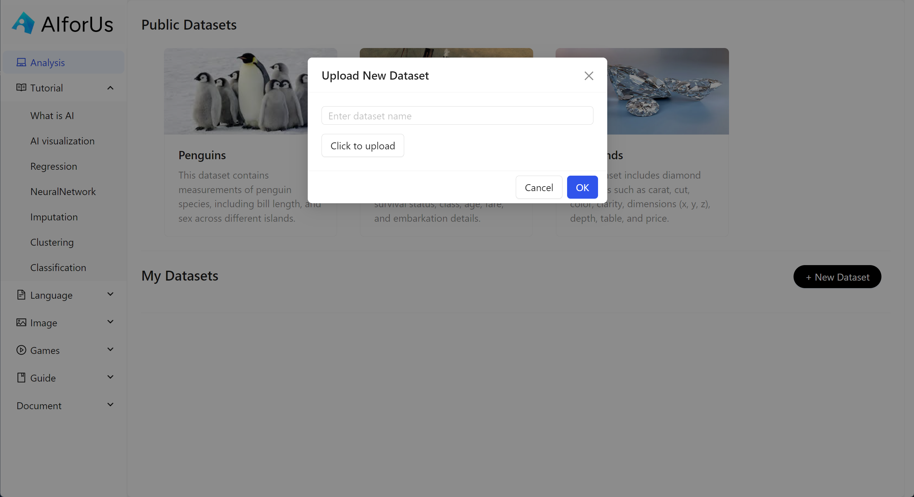
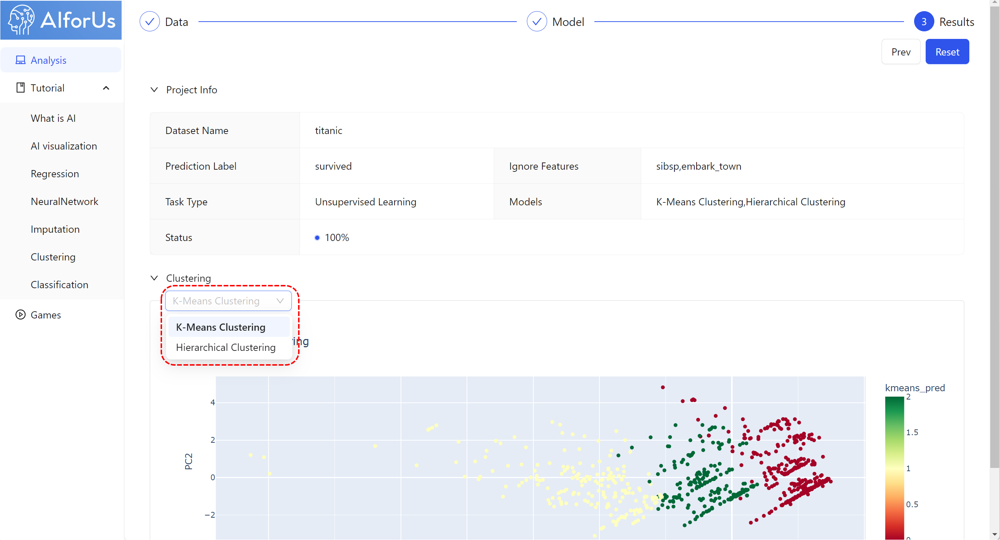

# Data Module

## Upload and organize data

Besides [hands-on practice](../exercise-platform.md#hands-on-datasets-practice), you can also analyze your own data by uploading your own datasets in CSV format.


**Note**: Both public datasets and uploaded datasets share the same excel-like interface.


1.  Click "New Dataset" button.

    <figure><figcaption>
My Datasets
</figcaption></figure>
2.  In the pop-up window, enter the dataset name you prefer and upload your dataset.

    _**It may cause up to 1 minute to upload your dataset.**_

    
<figure><figcaption>
Click to upload
</figcaption></figure>

3.  &#x20;Once your dataset is uploaded, you can find it under "My Datasets" section.

    <figure><figcaption>
Uploaded file
</figcaption></figure>

## Data Analysis

After selecting an appropriate dataset, we are ready for data analysis. We'll take "Titanic" dataset as an example.

We have 4 different steps for data analysis in our tool — Data Preporcessing, Data Processing, Model and Results. Let's look through them one by one.

### Data Preprocessing

#### Detail

We present the data you want to analyze in an excel-like interface, where you can finalize the data type for each column. We have 3 different data types as shown in the picture below:

1. Integer:
2. Category:
3. Float:

<figure><figcaption>
Change data type
</figcaption></figure>

If you have plenty of columns, you can simply click "Batch process" button on the top right corner, then you can select target type (Integer, Category or Float) and pattern (hover on the info icon  for the explanation).

<figure><figcaption>
Batch process
</figcaption></figure>

#### Summary

When you click "Summary" tab, you can also get the summary of the data, including basic information of the data, distribution of numerical and categorical features, etc.

<figure><figcaption>
Data summary
</figcaption></figure>

### Data Processing

#### Prediction Label

1.  For example, we choose "survived" as prediction label, shown as image below.

    <figure><figcaption>
Prediction label
</figcaption></figure>

#### Ignore Features

You can select any features you would like to ignore.

<figure><figcaption>
Ignore Features
</figcaption></figure>

#### Missing Data

There are 3 different ways to handle missing values — Mean, median and KNN (K-nearest neighbors), you can select based on your own needs.

<figure><figcaption>
Handle Missing Values
</figcaption></figure>

#### Categorical Encoding Method&#x20;

For all the categorical data, you can encode them by 2 options — label encoding and onehot encoding, as shown below.

<figure><figcaption>
Encode Categorical Data
</figcaption></figure>

#### Numerical Normalization

You can choose to use either minmax or standard method to normalize your data.

<figure><figcaption>
Normalize Standardize Data
</figcaption></figure>

<mark style="color:red;">**Note:**</mark>

In this case, "survived" is a categorical label, so you want to make sure the "TYPE" of this feature is "Category". You can achieve this by selecting "Category" in the dropdown list under "survived" .

At any time, you can return to the previous step and adjust your selections.

After all the data processing tasks, you can now proceed to the _Model_ section by simply clicking "Next" button.

## Visualize data

In the _Model_ section, you can choose to visualize your data using one of three major models—PCA, t-SNE, and UMAP (highlighted in the red dashed rectangle). See image below:

<figure><figcaption>
Visualize data
</figcaption></figure>

## Implement supervised/unsupervised learning

### Supervised learning

We offer various supervised learning models, see the image below:

<figure><figcaption>
Supervised learning models
</figcaption></figure>

After selecting your preferred models, you can proceed to the _Results_ section, where you can see the details of Performance, Feature Coefficients and Feature Importance.

<figure><figcaption>
Supervised learning results
</figcaption></figure>

### Unsupervised learning

We also offer various unsupervised learning models, see the image below:

<figure><figcaption>
Unsupervised learning models
</figcaption></figure>

Similarly, after selecting your preferred models, you can proceed to the _Results_ section, where you can see the clustering details.

<figure><figcaption>
Unsupervised learning results
</figcaption></figure>
