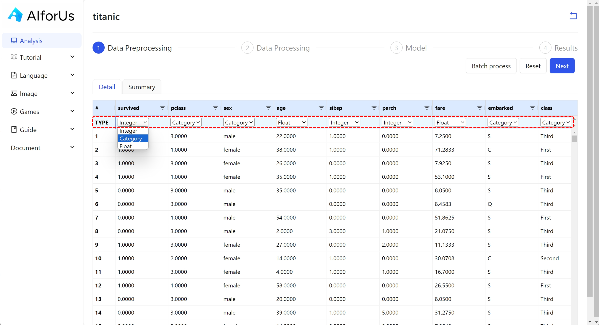

# Data Module

## Upload and organize data

In addition to [Exercise Platform](../../exercise-platform.md), you can analyze your own data by uploading CSV-format datasets.


**Note**: Both public datasets and uploaded datasets share the same excel-like interface.


1.  Click "New Dataset" button.

    <figure><figcaption>
My Datasets
</figcaption></figure>
2.  In the pop-up window, enter your preferred dataset name and upload your dataset.

    **The upload may take up to 30 seconds to complete.**

    
<figure><figcaption>
Upload new dataset
</figcaption></figure>

3.  _Once your dataset is uploaded, it will appear in the "My Datasets" section._

    <figure><figcaption>
Uploaded file
</figcaption></figure>

## Data Analysis

After selecting a dataset, you're ready to begin data analysis. In this tutorial, we’ll use the “Titanic” dataset as an example.

Our tool includes four steps for data analysis: **Data Preprocessing**, **Data Processing**, **Model**, and **Results**.&#x20;

You can find **Data Preprocessing** and **Data Processing** within this module, while **Model** and **Results** are explained in each specific use case.

### Data Preprocessing

This is the initial step in preparing raw data for machine learning. In AIforUs, this step is used to finalize the data type of each feature (column) in your dataset.

#### Detail

We present your data in an Excel-like interface, where you can review and finalize the data type for each column. There are three available data types:

* **Integer**: Whole numbers without decimal points. Integers are often used to represent counts or identifiers.
* **Category**: Labels or distinct groups, such as “red,” “blue,” or “green.” These are non-numeric values used to classify data.
* **Float**: Numbers that include decimal points, commonly used for continuous values like prices, weights, or probabilities.

For example, in the Titanic dataset, if you want to treat the "survived" column as categorical data, simply select **"Category"** from the dropdown list, as shown below.

<figure><figcaption>
Change data type
</figcaption></figure>

If you have many columns that start with, end with, or contain the same characters, you can process them all at once using the **Batch Process** feature.

Simply click the **"Batch Process"** button in the top-right corner. Then, choose the target data type (Integer, Category, or Float) and specify the pattern.

Hover over the info icon for guidance on how to use patterns effectively.

<figure><figcaption>
Batch process
</figcaption></figure>

#### Summary

By clicking the **"Summary"** tab, you can view an overview of your dataset, including basic statistics, as well as the distribution of numerical and categorical features.

<figure><figcaption>
Data summary
</figcaption></figure>

### Data Processing

This step involves cleaning, transforming, and organizing the data to prepare it for modeling.

#### Prediction Label

In the Titanic dataset, our goal is to predict whether a person survived. Therefore, we select the **"survived"** column as the prediction label. This column will be highlighted in green and locked to indicate its role.

<figure><figcaption>
Prediction label
</figcaption></figure>

#### Ignored Features

You can choose any features to exclude from your analysis, or simply skip this step to keep all features.

For example, in the Titanic dataset, if we exclude the features **"sibsp"** and **"embarked"**, their corresponding columns will be disabled.

<figure><figcaption>
Ignored Features
</figcaption></figure>

#### Missing Data

There are three methods to handle missing values: **mean**, **median**, and **KNN (K-nearest neighbors)**. You can choose the one that best suits your needs. In this example, we use the **mean** method.


**Note:** These three methods apply only to numerical data. For categorical data, treat missing values as a category and handle them using the Categorical Encoding method.


<figure><figcaption>
Handle missing data
</figcaption></figure>

#### Categorical Encoding Method&#x20;

For all categorical data, you can choose between two encoding options: **label encoding** and **one-hot encoding**.

**Label encoding**:

Label encoding is a categorical encoding method that assigns a unique integer to each category. It is best suited for ordinal data, where the order of categories is meaningful.

<figure><figcaption>
Label  encoding
</figcaption></figure>

**One-hot encoding**:

One-hot encoding is a categorical encoding method that creates a separate binary column for each category. Each row has a ‘1’ in the column corresponding to its category and ‘0’ in all others.

<figure><figcaption>
Onehot encoding
</figcaption></figure>

#### Numerical Normalization

Numerical normalization scales numerical data into a specific range or distribution to enhance model performance.

In AIforUs, you can choose between **Min-Max normalization** and **Standard normalization** methods to normalize your data.

**Min-Max**:

Min-Max is the process of scaling numerical data into a specific range or distribution to improve model performance.

<figure><figcaption>
Minmax
</figcaption></figure>

**Standard**:

Standard, or standardization, is a normalization method that transforms data to have a mean of 0 and a standard deviation of 1. It centers the data and is useful when features have different units or scales.

<figure><figcaption>
Standard
</figcaption></figure>


At any time, you can return to the previous step and adjust your selections.


After completing all data processing tasks, click the **"Next"** button to proceed to the Model section.

## Model

Models are mathematical representations created by machine learning algorithms to learn patterns from data. Once trained, they can make predictions on new, unseen data.

Our tool offers models in four categories: **Supervised Learning (Classification)**, **Supervised Learning (Regression)**, **Unsupervised Learning**, and **Visualization**. For more details, please refer to the corresponding use cases.

