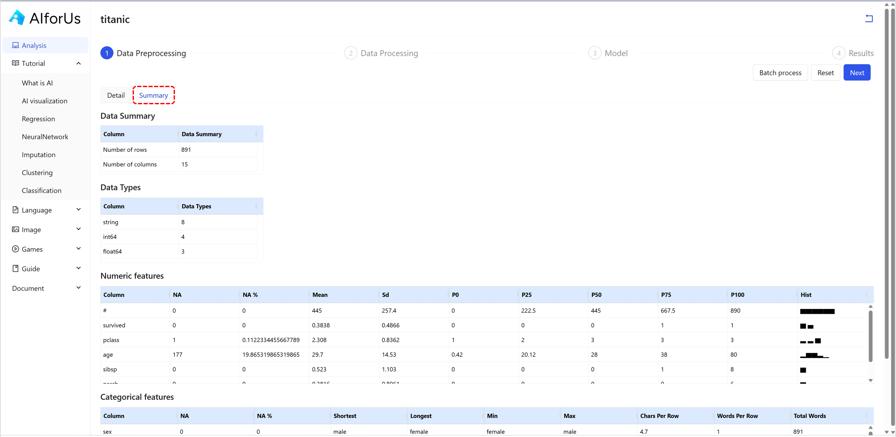
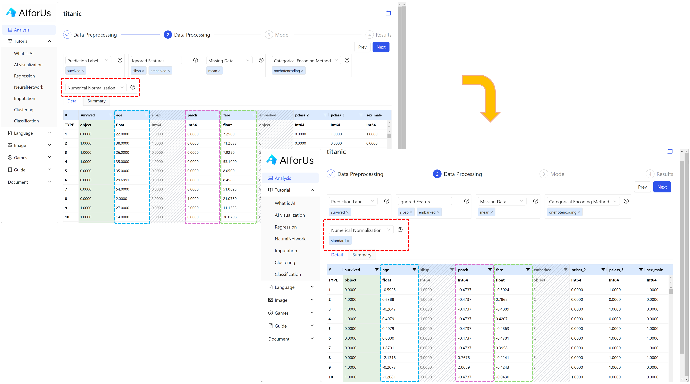

# Data Module

## Upload and organize data

Besides [hands-on practice](../../exercise-platform.md#hands-on-datasets-practice), you can also analyze your own data by uploading your own datasets in CSV format.


**Note**: Both public datasets and uploaded datasets share the same excel-like interface.


1.  Click "New Dataset" button.

    <figure><figcaption>
My Datasets
</figcaption></figure>
2.  In the pop-up window, enter the dataset name you prefer and upload your dataset.

    _**It may take up to 1 minute to upload your dataset.**_

    
<figure><figcaption>
Click to upload
</figcaption></figure>

3.  &#x20;Once your dataset is uploaded, you can find it under "My Datasets" section.

    <figure><figcaption>
Uploaded file
</figcaption></figure>

## Data Analysis

After selecting an appropriate dataset, we are ready for data analysis. In this tutorial, we'll take "Titanic" dataset as an example.

We have 4 different steps for data analysis in our tool — **Data Preporcessing**, **Data Processing**, **Model** and **Results**. Let's look through them one by one.

### Data Preprocessing

This is the initial step in preparing raw data for machine learning. In AIforUs, we use this step to finalize the data type for each feature (column) of your data. You can&#x20;

#### Detail

We present the data in an excel-like interface, where you can finalize the data type for each column. We have 3 different data types:

1. Integer: A whole number without any decimal part. In data, integers are often used to represent counts or identifiers.
2. Category: A type of data that represents labels or distinct groups, such as “red”, “blue”, or “green”. These values are non-numeric and are used to classify information.
3. Float: A number that includes a decimal point. Floats are commonly used to represent continuous values, such as prices, weights, or probabilities.

In Titanic dataset, we want to make column "survived" categorical data, as indicated below:

<figure><figcaption>
Change data type
</figcaption></figure>

If you have plenty of columns starting/ending/containing same characters, you can process them all at once.&#x20;

You can simply click "Batch process" button on the top right corner, then you can select target type (Integer, Category or Float) and pattern (hover on the info icon  for the explanation of how to utilize it).

<figure><figcaption>
Batch process
</figcaption></figure>

#### Summary

If you click "Summary" tab, you can also get the summary of the data, including basic information of the data, distribution of numerical and categorical features, etc.

<figure><figcaption>
Data summary
</figcaption></figure>

### Data Processing

This step includes cleaning, transforming, and organizing data to make it suitable for modeling.

#### Prediction Label

In Titanic dataset, we want to predict if a person is survived or not, so we select "survived" as the prediction label. The column "survived" will be locked by green color.

<figure><figcaption>
Prediction label
</figcaption></figure>

#### Ignored Features

You can select any features you would like to ignore in your data, or if you want to keep all the features, just skip this step. In Titanic dataset, we take features of "sibsp" and "embarked" as an example. The corresponding columns become disabled.

<figure><figcaption>
Ignored Features
</figcaption></figure>

#### Missing Data

There are 3 different ways to handle missing values — mean, median and KNN (K-nearest neighbors), you can select based on your own needs.  We take mean as an example.


Note: these 3 methods only work on numerical data. If you want to take care of categorical data, you want to consider it as a category, and tale care of it under [Categorical Encoding Method](./#categorical-encoding-method).


<figure><figcaption>
Handle missing data
</figcaption></figure>

#### Categorical Encoding Method&#x20;

For all the categorical data, you can encode them by 2 options — label encoding and onehot encoding.&#x20;

**Label encoding**:

Label encoding is a method of categorical encoding where each category is assigned a unique integer value. It is suitable for ordinal data, where the order of categories matters.

<figure><figcaption>
Label  encoding
</figcaption></figure>

**Onehot encoding**:

Onehot encoding is a method of categorical encoding that creates a new binary column for each category. Each row has a ‘1’ in the column of its category and ‘0’ in others.

<figure><figcaption>
Onehot encoding
</figcaption></figure>

#### Numerical Normalization

Numerical normalization is the process of scaling numerical data into a specific range or distribution to improve model performance.

In AIforUs, you can choose to use either minmax or standard normalization method to normalize your data.

**Minmax**:

Minmax is the process of scaling numerical data into a specific range or distribution to improve model performance.

<figure><figcaption>
Minmax
</figcaption></figure>

**Standard**:

Standard, or standardization, is a normalization method that transforms data to have a mean of 0 and a standard deviation of 1. It centers the data and is useful when features have different units or scales.

<figure><figcaption>
Standard
</figcaption></figure>


At any time, you can return to the previous step and adjust your selections.


After all the data processing tasks, you can now proceed to the _Model_ section by simply clicking "Next" button.

## Model

Models are mathematical representations created by a machine learning algorithm to learn patterns from data. Once trained, a model can make predictions on new, unseen data.

In our tool, the models include [Supervised Learning Classification](use-case-supervised-learning-classification.md), [Supervised Learning Regression](use-case-supervised-learning-regression.md), [Unsupervised Learning](use-case-unsupervised-learning.md) and [Visualization](use-case-visualization.md). You can refer to the corresponding use cases for more information.

### Visualization

In the _Model_ section, you can choose to visualize your data using one of three major models—PCA, t-SNE, and UMAP (highlighted in the red dashed rectangle). See image below:

<figure><figcaption>
Visualize data
</figcaption></figure>

## Results

After selecting your preferred models, you can proceed to the _Results_ section, where you can see the details of Performance, Feature Coefficients and Feature Importance.

### Results for Supervised Learning

<figure><figcaption>
Supervised learning results
</figcaption></figure>

### Results for Unsupervised Learning

We also offer various unsupervised learning models, see the image below:

<figure><figcaption>
Unsupervised learning models
</figcaption></figure>

Similarly, after selecting your preferred models, you can proceed to the _Results_ section, where you can see the clustering details.

<figure><figcaption>
Unsupervised learning results
</figcaption></figure>

