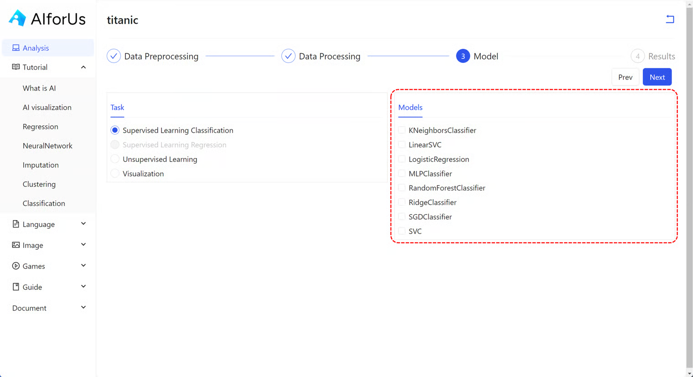
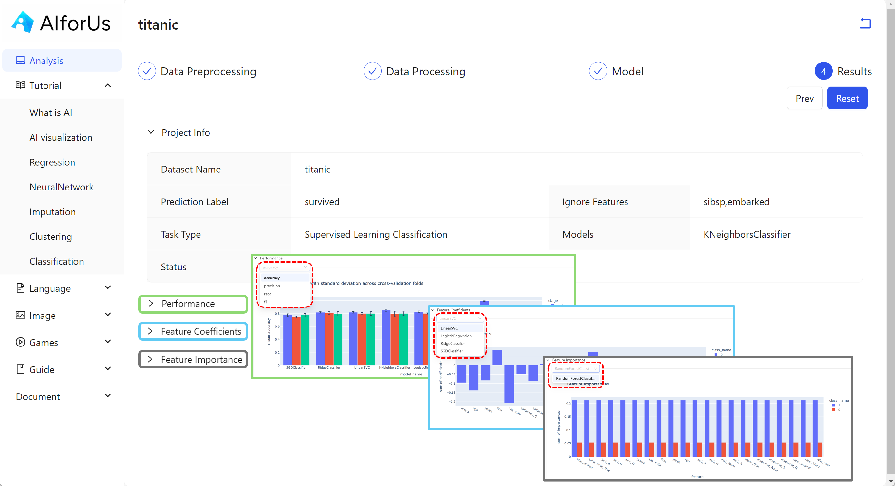

# Use Case: Supervised Learning Classification

## Models

<figure><figcaption>
Supervised learning classification models
</figcaption></figure>

Under supervised learning classification, we have several different models:

*   KNeighbors

    A model that classifies a data point based on how its **nearest neighbors** are labeled. It looks at the 'K' closest points in the training data and predicts the most common label among them.

    > **Best for:** Simple problems with clearly clustered classes.\
    > **Key concept:** “Birds of a feather flock together.”
*   LinearSVC (Linear Support Vector Classifier)

    A fast and efficient classifier that finds a **straight line (or hyperplane)** to separate classes in the data. It is a linear version of the more general Support Vector Machine (SVM).

    > **Best for:** High-dimensional, linearly separable data.\
    > **Key feature:** Works well for text classification tasks.
*   Logistic Regression

    Despite its name, this model is used for **classification**, not regression. It estimates the probability of a class using a mathematical function (logistic/sigmoid), making it useful for binary or multi-class tasks.

    > **Best for:** Binary classification problems.\
    > **Key advantage:** Outputs class probabilities.
*   MLP Classifier (Multi-Layer Perceptron)

    A type of **neural network** model that learns non-linear relationships using multiple layers of artificial neurons. It’s capable of modeling complex patterns.

    > **Best for:** Non-linear and complex classification tasks.\
    > **Note:** Requires more computation and tuning.
*   Random Forest

    An **ensemble model** that builds multiple decision trees and combines their results for more accurate and robust predictions.

    > **Best for:** Versatile, general-purpose classification.\
    > **Key advantage:** Handles both numerical and categorical features well.
*   Ridge Classifier

    A linear model similar to logistic regression, but uses **regularization** (penalty on large weights) to prevent overfitting. It’s useful when the number of features is high.

    > **Best for:** High-dimensional data with possible overfitting issues.\
    > **Key term:** L2 regularization.
*   SGD (Stochastic Gradient Descent)

    A fast and scalable linear classifier that uses a **step-by-step learning process** to update the model. It is especially useful for large-scale datasets.

    > **Best for:** Large datasets and real-time updates.\
    > **Note:** Requires careful tuning of learning rate and iterations.
*   SVC (Support Vector Classifier)

    A general form of Support Vector Machine (SVM) that finds the optimal boundary between classes and can model **non-linear relationships** using kernel tricks.

    > **Best for:** Complex but small-to-medium-sized datasets.\
    > **Key feature:** Can use non-linear boundaries via kernels.

### Comparison

<table><thead><tr><th width="108.5712890625">Model</th><th width="89.7142333984375">Type</th><th width="182.8568115234375">Handles Non-linear Data</th><th width="111.4285888671875">Fast Training</th><th width="106.857177734375">Interpretable</th><th width="154.285400390625">Good for Large Data</th><th>Key Strength</th></tr></thead><tbody><tr><td><strong>KNeighbors</strong></td><td>Instance-based</td><td>✅ (with distance metric)</td><td>❌</td><td>✅</td><td>❌</td><td>Simple, no training phase</td></tr><tr><td><strong>LinearSVC</strong></td><td>Linear</td><td>❌</td><td>✅</td><td>✅</td><td>✅</td><td>Fast for high-dimensional sparse data</td></tr><tr><td><strong>Logistic Regression</strong></td><td>Linear</td><td>❌</td><td>✅</td><td>✅</td><td>✅</td><td>Outputs probabilities</td></tr><tr><td><strong>MLP Classifier</strong></td><td>Neural Network</td><td>✅</td><td>❌</td><td>❌</td><td>⚠️ (tunable)</td><td>Learns complex non-linear patterns</td></tr><tr><td><strong>Random Forest</strong></td><td>Ensemble (Trees)</td><td>✅</td><td>⚠️ Medium</td><td>⚠️ Medium</td><td>✅</td><td>Robust, handles mixed data types</td></tr><tr><td><strong>Ridge Classifier</strong></td><td>Linear</td><td>❌</td><td>✅</td><td>✅</td><td>✅</td><td>Regularization reduces overfitting</td></tr><tr><td><strong>SGD Classifier</strong></td><td>Linear</td><td>❌</td><td>✅✅✅</td><td>⚠️ Medium</td><td>✅✅✅</td><td>Scales well, fast online learning</td></tr><tr><td><strong>SVC</strong></td><td>SVM (kernel-based)</td><td>✅ (with kernel)</td><td>❌</td><td>⚠️ Medium</td><td>❌</td><td>Very accurate for small datasets</td></tr></tbody></table>

| Scenario / Use Case                                     | Recommended Models                        | Why?                                             |
| ------------------------------------------------------- | ----------------------------------------- | ------------------------------------------------ |
| **Small dataset with clear margin between classes**     | `SVC`, `Logistic Regression`              | High accuracy, well-defined boundaries           |
| **Large dataset with millions of examples**             | `SGD`, `Logistic Regression`              | Fast, scalable to large data                     |
| **High-dimensional sparse data (e.g., text)**           | `LinearSVC`, `SGD`, `Logistic Regression` | Efficient with sparse input                      |
| **Data with mixed feature types and missing values**    | `RandomForest`                            | Handles numerical + categorical + missing values |
| **Non-linear patterns and complex decision boundaries** | `MLP Classifier`, `SVC (with RBF kernel)` | Models complex relationships                     |
| **Need for fast prototype and interpretable model**     | `Logistic Regression`, `Ridge Classifier` | Easy to interpret, quick to test                 |
| **Small dataset, no training time constraints**         | `KNeighbors`, `SVC`                       | Simple to use, no model assumptions              |
| **Overfitting is a concern**                            | `Ridge Classifier`, `RandomForest`        | Built-in regularization or ensemble effect       |

## Results

<figure><figcaption>
Supervised learning classification results
</figcaption></figure>
