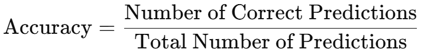
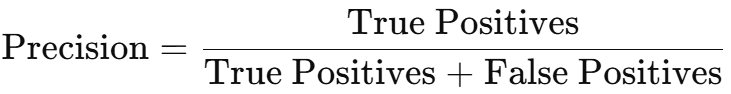
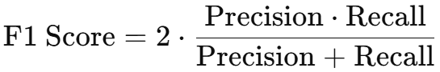

# Use Case: Supervised Learning Classification

## Models

<figure><figcaption>
Supervised learning classification models
</figcaption></figure>

Under supervised learning classification, we have several different models:

*   KNeighbors

    A model that classifies a data point based on how its **nearest neighbors** are labeled. It looks at the 'K' closest points in the training data and predicts the most common label among them.

    > **Best for:** Simple problems with clearly clustered classes.\
    > **Key concept:** “Birds of a feather flock together.”
*   LinearSVC (Linear Support Vector Classifier)

    A fast and efficient classifier that finds a **straight line (or hyperplane)** to separate classes in the data. It is a linear version of the more general Support Vector Machine (SVM).

    > **Best for:** High-dimensional, linearly separable data.\
    > **Key feature:** Works well for text classification tasks.
*   Logistic Regression

    Despite its name, this model is used for **classification**, not regression. It estimates the probability of a class using a mathematical function (logistic/sigmoid), making it useful for binary or multi-class tasks.

    > **Best for:** Binary classification problems.\
    > **Key advantage:** Outputs class probabilities.
*   MLP Classifier (Multi-Layer Perceptron)

    A type of **neural network** model that learns non-linear relationships using multiple layers of artificial neurons. It’s capable of modeling complex patterns.

    > **Best for:** Non-linear and complex classification tasks.\
    > **Note:** Requires more computation and tuning.
*   Random Forest

    An **ensemble model** that builds multiple decision trees and combines their results for more accurate and robust predictions.

    > **Best for:** Versatile, general-purpose classification.\
    > **Key advantage:** Handles both numerical and categorical features well.
*   Ridge Classifier

    A linear model similar to logistic regression, but uses **regularization** (penalty on large weights) to prevent overfitting. It’s useful when the number of features is high.

    > **Best for:** High-dimensional data with possible overfitting issues.\
    > **Key term:** L2 regularization.
*   SGD (Stochastic Gradient Descent)

    A fast and scalable linear classifier that uses a **step-by-step learning process** to update the model. It is especially useful for large-scale datasets.

    > **Best for:** Large datasets and real-time updates.\
    > **Note:** Requires careful tuning of learning rate and iterations.
*   SVC (Support Vector Classifier)

    A general form of Support Vector Machine (SVM) that finds the optimal boundary between classes and can model **non-linear relationships** using kernel tricks.

    > **Best for:** Complex but small-to-medium-sized datasets.\
    > **Key feature:** Can use non-linear boundaries via kernels.

### Comparison

<table><thead><tr><th width="108.5712890625">Model</th><th width="89.7142333984375">Type</th><th width="182.8568115234375">Handles Non-linear Data</th><th width="111.4285888671875">Fast Training</th><th width="106.857177734375">Interpretable</th><th width="154.285400390625">Good for Large Data</th><th>Key Strength</th></tr></thead><tbody><tr><td><strong>KNeighbors</strong></td><td>Instance-based</td><td>✅ (with distance metric)</td><td>❌</td><td>✅</td><td>❌</td><td>Simple, no training phase</td></tr><tr><td><strong>LinearSVC</strong></td><td>Linear</td><td>❌</td><td>✅</td><td>✅</td><td>✅</td><td>Fast for high-dimensional sparse data</td></tr><tr><td><strong>Logistic Regression</strong></td><td>Linear</td><td>❌</td><td>✅</td><td>✅</td><td>✅</td><td>Outputs probabilities</td></tr><tr><td><strong>MLP Classifier</strong></td><td>Neural Network</td><td>✅</td><td>❌</td><td>❌</td><td>⚠️ (tunable)</td><td>Learns complex non-linear patterns</td></tr><tr><td><strong>Random Forest</strong></td><td>Ensemble (Trees)</td><td>✅</td><td>⚠️ Medium</td><td>⚠️ Medium</td><td>✅</td><td>Robust, handles mixed data types</td></tr><tr><td><strong>Ridge Classifier</strong></td><td>Linear</td><td>❌</td><td>✅</td><td>✅</td><td>✅</td><td>Regularization reduces overfitting</td></tr><tr><td><strong>SGD Classifier</strong></td><td>Linear</td><td>❌</td><td>✅✅✅</td><td>⚠️ Medium</td><td>✅✅✅</td><td>Scales well, fast online learning</td></tr><tr><td><strong>SVC</strong></td><td>SVM (kernel-based)</td><td>✅ (with kernel)</td><td>❌</td><td>⚠️ Medium</td><td>❌</td><td>Very accurate for small datasets</td></tr></tbody></table>

| Scenario / Use Case                                     | Recommended Models                        | Why?                                             |
| ------------------------------------------------------- | ----------------------------------------- | ------------------------------------------------ |
| **Small dataset with clear margin between classes**     | `SVC`, `Logistic Regression`              | High accuracy, well-defined boundaries           |
| **Large dataset with millions of examples**             | `SGD`, `Logistic Regression`              | Fast, scalable to large data                     |
| **High-dimensional sparse data (e.g., text)**           | `LinearSVC`, `SGD`, `Logistic Regression` | Efficient with sparse input                      |
| **Data with mixed feature types and missing values**    | `RandomForest`                            | Handles numerical + categorical + missing values |
| **Non-linear patterns and complex decision boundaries** | `MLP Classifier`, `SVC (with RBF kernel)` | Models complex relationships                     |
| **Need for fast prototype and interpretable model**     | `Logistic Regression`, `Ridge Classifier` | Easy to interpret, quick to test                 |
| **Small dataset, no training time constraints**         | `KNeighbors`, `SVC`                       | Simple to use, no model assumptions              |
| **Overfitting is a concern**                            | `Ridge Classifier`, `RandomForest`        | Built-in regularization or ensemble effect       |

## Results

<figure><figcaption>
Supervised learning classification results
</figcaption></figure>

There are 3 major results:

1.  **Performance (green rectangle)**

    You can check different performance based on the models, with standard deviation across cross-validation folds. These are key to understanding how well a machine learning model performs, especially in different contexts like imbalanced datasets.

    1.  accuracy:

        The ratio of correct predictions to total predictions.

        <figure><figcaption>
accuracy equation
</figcaption></figure>
    2.  precision:

        The proportion of positive predictions that are actually correct.

        <figure><figcaption>
precision equation
</figcaption></figure>
    3.  recall:

        The proportion of actual positives that were correctly predicted. It is also called sensitivity or true positive rate.

        <figure><figcaption>
recall equation
</figcaption></figure>
    4.  F1 score:

        The harmonic mean of precision and recall, balancing the two.

        <figure><figcaption>
F1 score equation
</figcaption></figure>

    ### Comparison

    | Metric    | What It Measures                     | Best Use Case                         | Sensitive To Imbalance? |
    | --------- | ------------------------------------ | ------------------------------------- | ----------------------- |
    | Accuracy  | Overall correctness of predictions   | Balanced datasets                     | ✅ Yes                   |
    | Precision | Correctness of positive predictions  | When false positives are costly       | ✅ Yes                   |
    | Recall    | Coverage of actual positive cases    | When false negatives are costly       | ✅ Yes                   |
    | F1 Score  | Balance between precision and recall | Imbalanced data with need for balance | ✅ Yes                   |
2.  **Feature Coefficients (blue rectangle)**

    In linear models (like Linear Regression, Logistic Regression, Ridge, or Lasso), feature coefficients are numerical values that represent the influence of each input feature on the model’s prediction.

    * A **positive coefficient** means the feature **increases** the prediction.
    * A **negative coefficient** means the feature **decreases** the prediction.
    * A **larger absolute value** (positive or negative) means the feature has **more influence**.

    Feature coefficients can do the following:

    * Help with **model interpretation**: understand **how the model makes decisions**.
    * Useful for **feature selection**: large or non-zero coefficients may indicate important features.
    * Aid in **debugging**: identify if the model is focusing on the right signals.

    #### ⚠️ **Note:**

    * Coefficients are **only directly interpretable in linear models**.
    * In regularized models like **Lasso** or **Ridge**, coefficients are **shrunk** or **zeroed out** to prevent overfitting.
    * For non-linear models (e.g., RandomForest, MLP), you typically use **feature importance scores**, not coefficients.
3.  **Feature Importance (grey rectangle)**

    Feature importance refers to a score or ranking that indicates how much influence each feature (input variable) has on a machine learning model’s predictions.

    > In simpler terms: it tells you **which features matter most** when the model makes a decision.

    It is useful because:

    * Helps users **understand** how the model works.
    * Aids in **feature selection** (removing unimportant inputs).
    * Useful for **debugging**, **model interpretation**, and **transparency** in AI applications.

    It depends on the type of model:

    | Model Type                                           | Feature Importance Method                                                    |
    | ---------------------------------------------------- | ---------------------------------------------------------------------------- |
    | **Tree-based models** (e.g., RandomForest, XGBoost)  | Based on how often and how significantly a feature is used to split the data |
    | **Linear models** (e.g., Logistic Regression, Ridge) | Based on the **magnitude of the coefficients** (with some scaling)           |

    #### ⚠️ Important Notes:

    * Feature importance **does not show direction** (i.e., whether the feature increases or decreases the prediction).
    * Importance values are **relative**, not absolute.
    * Interpretability varies depending on the model used.
