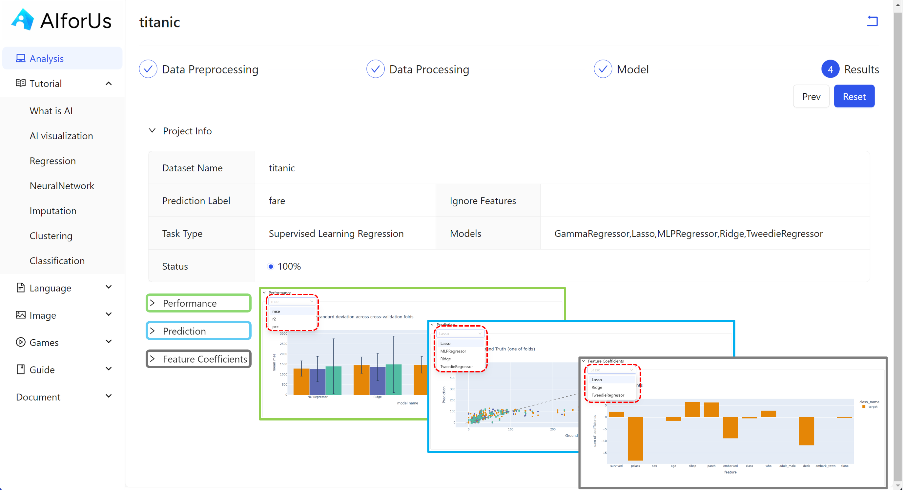

# Use Case: Supervised Learning Regression

## Models

<figure><figcaption>
Supervised learning regression models
</figcaption></figure>

Under supervised learning regression, we have several different models:

*   Gamma Regressor

    A model used for predicting **positive, skewed continuous values**, often found in **insurance claims, healthcare costs, or time-to-event data**. It assumes the target variable follows a **Gamma distribution**.

    > **Use when:** The target is strictly positive and right-skewed (e.g., `cost`, `duration`).\
    > **Special feature:** Tailored for data with **non-constant variance** and **skewed distributions**.
*   Lasso (Least Absolute Shrinkage and Selection Operator)

    A **linear regression model** that includes **L1 regularization**, which can shrink some coefficients **exactly to zero**, effectively performing **feature selection**.

    > **Use when:** You have many features, and want to remove unimportant ones automatically.\
    > **Advantage:** Helps prevent overfitting and creates simpler models.
*   MLP Regressor

    A **neural network model** for regression that uses one or more layers of interconnected neurons. It can **model complex non-linear relationships** between features and target values.

    > **Use when:** The relationship between input and output is **non-linear**.\
    > **Note:** Requires more data and tuning compared to linear models.
*   Ridge Regression

    A **linear regression model** with **L2 regularization**, which shrinks the magnitude of coefficients to prevent overfitting, but **does not eliminate any**.

    > **Use when:** You want to retain all features but avoid overfitting in high-dimensional data.\
    > **Key trait:** Smooths model weights but doesn’t zero them out.
*   Tweedie Regressor

    A flexible model that can represent various types of data distributions by adjusting a **power parameter**. It includes:

    * **Power = 0**: Normal distribution (like Linear Regression)
    * **Power = 1**: Poisson (counts)
    * **Power = 2**: Gamma (positive skewed values)
    * **1 < Power < 2**: Compound Poisson–Gamma (e.g., insurance claim totals)

    > **Use when:** The target has a **non-normal distribution**, especially in **generalized linear modeling** contexts.\
    > **Best for:** Use cases like **insurance risk modeling**, **claims**, or **biostatistics**.

### Comparison

| Model                 | Model Type         | Handles Non-linear Data | Feature Selection | Regularization Type | Requires Positive Target    | Use Case Example                              |
| --------------------- | ------------------ | ----------------------- | ----------------- | ------------------- | --------------------------- | --------------------------------------------- |
| **Gamma Regressor**   | Generalized Linear | ❌                       | ❌                 | None                | ✅ Yes                       | Predicting insurance claim costs              |
| **Lasso**             | Linear             | ❌                       | ✅ Yes             | L1                  | ❌                           | Sparse models for housing prices              |
| **MLP Regressor**     | Neural Network     | ✅ Yes                   | ❌                 | None (optional)     | ❌                           | Modeling energy consumption                   |
| **Ridge**             | Linear             | ❌                       | ❌                 | L2                  | ❌                           | Financial forecasting with many features      |
| **Tweedie Regressor** | Generalized Linear | ❌                       | ❌                 | None                | ⚠️ Often (depends on power) | Insurance total claims, count + cost modeling |

| Scenario or Problem Type                                                                | Recommended Model   | Why?                                                    |
| --------------------------------------------------------------------------------------- | ------------------- | ------------------------------------------------------- |
| Target values are **strictly positive** and **right-skewed**                            | `Gamma Regressor`   | Gamma distribution models skewed positive values        |
| You have **many features** and want to **automatically reduce** them                    | `Lasso`             | Performs feature selection via L1 regularization        |
| The relationship is **non-linear** and you have enough data                             | `MLP Regressor`     | Can learn complex, non-linear patterns                  |
| You want to prevent **overfitting** but keep all features                               | `Ridge`             | Shrinks coefficients without eliminating them           |
| You want a **flexible model** that can handle Poisson, Gamma, or compound distributions | `Tweedie Regressor` | Ideal for count + cost or aggregated insurance modeling |

## Results

There are 3 major results:

1. Performance (green rectangle)
2. Feature Coefficients (blue rectangle)
3. Feature Importance (grey rectangle)

<figure><figcaption></figcaption></figure>
