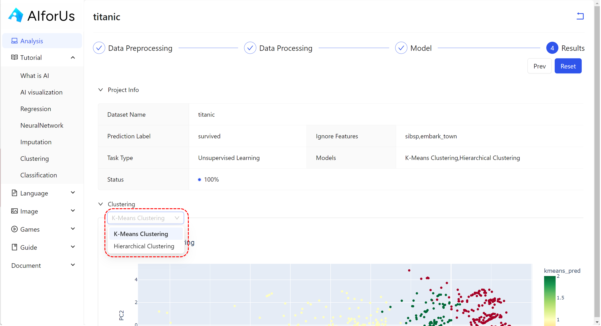

# Use Case: Unsupervised Learning

## Models

<figure><figcaption>
Unsupervised learning models
</figcaption></figure>

Under unsupervised learning, we mainly focus on clustering technique.

Clustering is an **unsupervised learning technique** that groups data points based on similarity. It is used when the data has **no labels** and you want to discover structure or patterns.

*   K-Means Clustering

    A popular clustering algorithm that divides the dataset into **K groups (clusters)** by minimizing the **distance between points and their cluster centers (centroids)**.

    > **Use when:** You know (or want to define) how many clusters you need.\
    > **How it works:**
    >
    > * Choose number of clusters `K`.
    > * Assign each point to the nearest cluster center.
    > * Recalculate cluster centers.
    > * Repeat until assignments stabilize.
    >
    > **Strength:** Fast and scalable.\
    > **Limitation:** Requires predefined `K`; struggles with irregular cluster shapes.
*   Hierarchical Clustering

    A method that builds a **tree (dendrogram)** of clusters by **either merging** or **splitting** them iteratively based on distance.

    > **Use when:** You want to explore data at multiple levels of granularity.\
    > **Two main types:**
    >
    > * **Agglomerative (bottom-up):** Start with individual points, merge into clusters.
    > * **Divisive (top-down):** Start with all points, split into smaller clusters.

    > **Strength:** No need to predefine the number of clusters.\
    > **Limitation:** Computationally intensive on large datasets.

### Comparison

| Feature                     | **K-Means Clustering**           | **Hierarchical Clustering**     |
| --------------------------- | -------------------------------- | ------------------------------- |
| Type                        | Partitional                      | Hierarchical                    |
| Requires number of clusters | ✅ Yes                            | ❌ No                            |
| Handles large datasets well | ✅ Good                           | ❌ Slower                        |
| Output format               | Flat clusters                    | Dendrogram (tree)               |
| Works well for              | Spherical, evenly sized clusters | Nested or irregular clusters    |
| Interpretation              | Simple centroids                 | Tree-based, multi-level         |
| Reproducible results        | ⚠️ May vary by init              | ✅ Deterministic (in most cases) |

| Scenario or Goal                                         | Recommended Model         | Why?                                              |
| -------------------------------------------------------- | ------------------------- | ------------------------------------------------- |
| You need to divide data into a specific number of groups | `K-Means Clustering`      | Fast and efficient with known `K`                 |
| You want to **explore structure** in the data            | `Hierarchical Clustering` | Reveals nested relationships and doesn’t need `K` |
| You have a **large dataset** and performance matters     | `K-Means Clustering`      | Scales better than hierarchical methods           |
| You want a **visual understanding** of cluster hierarchy | `Hierarchical Clustering` | Dendrogram provides intuitive cluster tree        |

## Results

<figure><figcaption>
Unsupervised learning results
</figcaption></figure>
