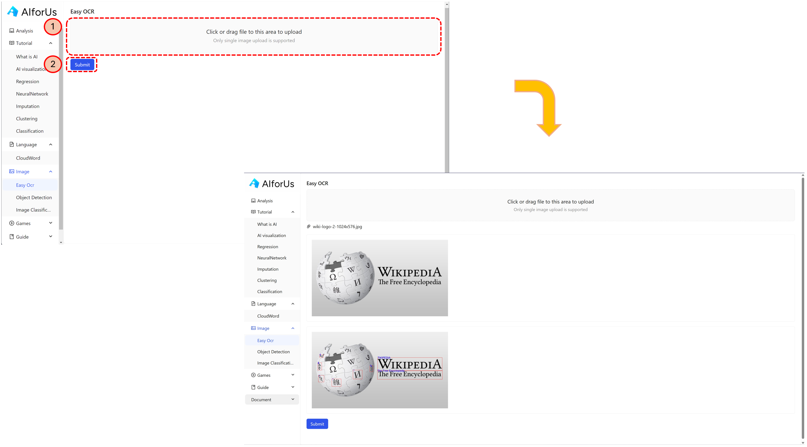
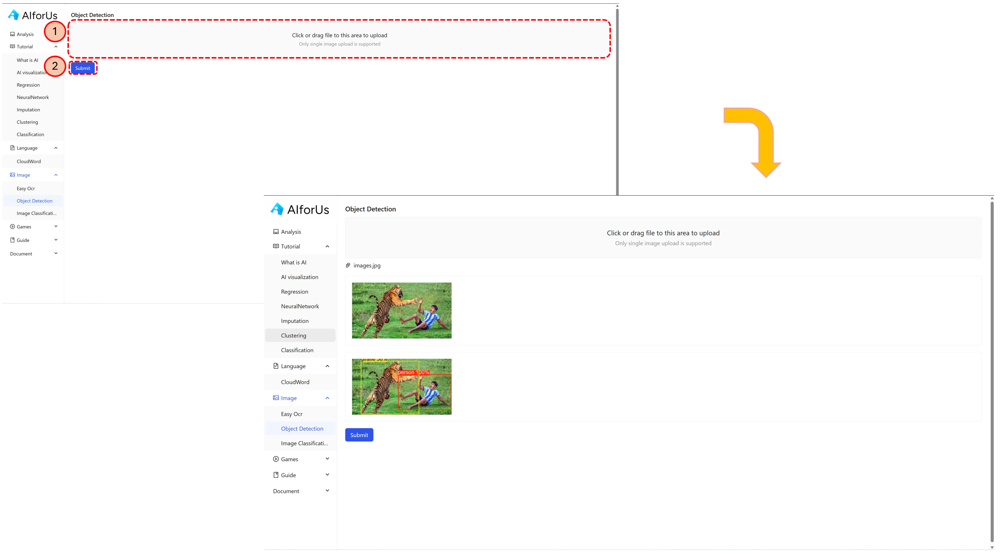
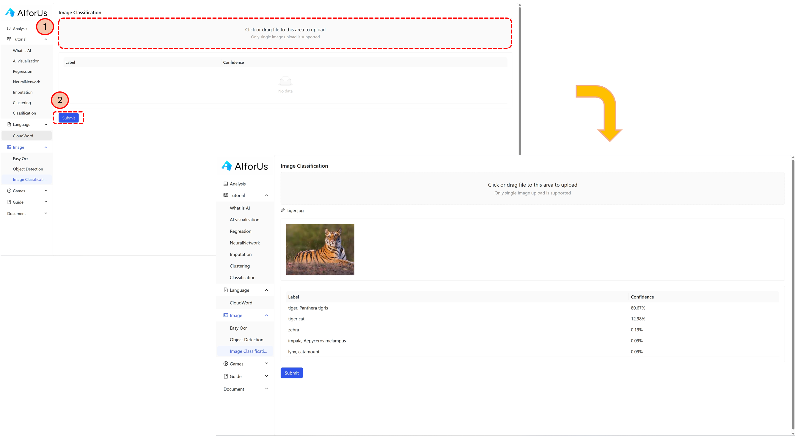

# Image Module

We offer 3 different image recognition methods — Easy OCR, Object Detection and Image Classification. Please try all of the 3 methods and have fun with each of them!

There are only 2 simple steps needed when applying each method — **Upload image** and **Click "Submit".**

## Easy OCR

<figure><figcaption>
Easy OCR
</figcaption></figure>

## Object Detection

<figure><figcaption>
Object Detection
</figcaption></figure>

## Image Classification

<figure><figcaption>
Image Classification
</figcaption></figure>
