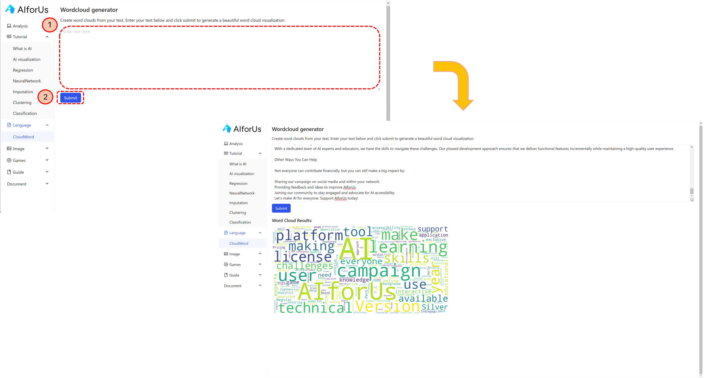

# Language Module

Currently, we provide Word cloud visualization, which requires only 2 steps:

1. Enter the text that you want to generate word cloud for.
2. Click "Submit".

<figure><figcaption>
Word cloud
</figcaption></figure>

