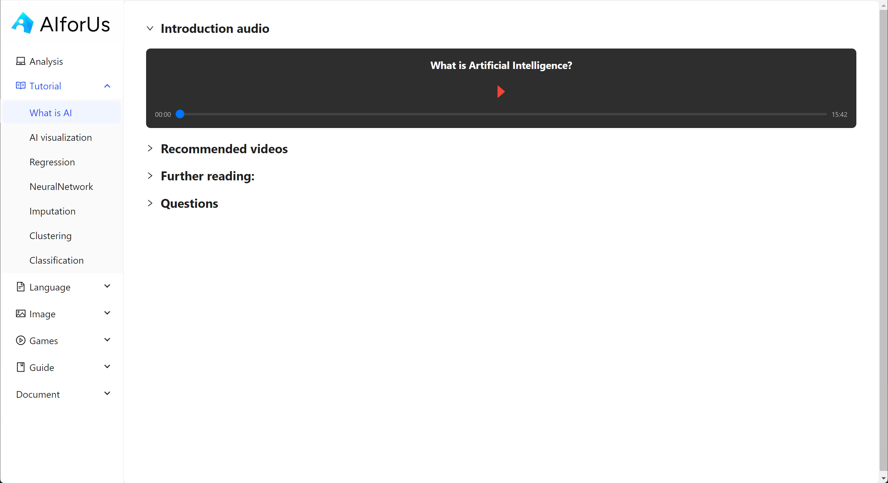
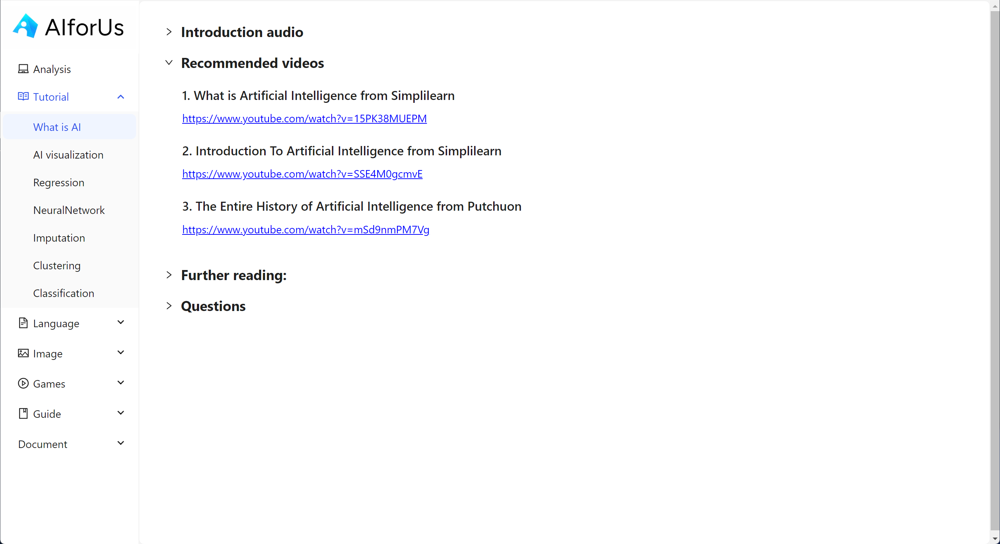
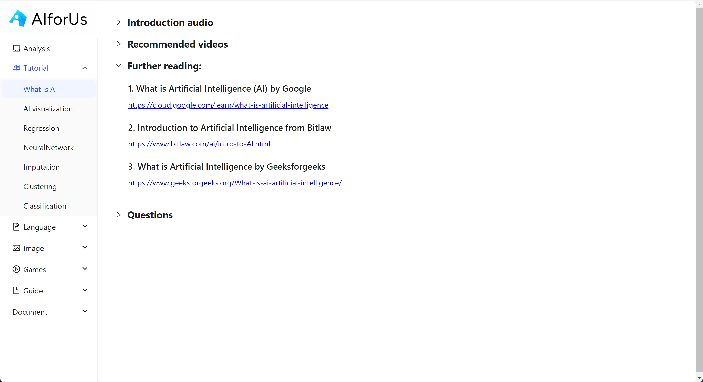

# Educational Resources

We offer exclusive tutorials designed specifically for our learners. You can find them in the **Tutorial** section on the left-hand navigation panel.

Our current tutorials cover fundamental concepts in the field of AI, with many more topics to be added in the future.

Each concept is organized into four parts:

* **Introduction Audio**
* **Recommended Videos**
* **Further Reading**
* **Practice Questions**

## Introduction audio

When exploring a new AI topic, it's important to begin with a clear understanding of the core concept. Our **Introduction Audio** offers the ideal starting point—just click the play button in the image below to dive into an engaging and insightful overview.

<figure><figcaption>
Introduction audio
</figcaption></figure>

## Recommended videos

Once you’ve grasped the basics of a new concept, it’s time to deepen your understanding. That’s why we’ve curated a set of **Recommended Videos**—handpicked to reinforce your knowledge and help you build a solid foundation in the topic.

<figure><figcaption>
Recommended videos
</figcaption></figure>

## Further reading

Once you’ve developed a solid understanding of the concept, you might be ready to explore it more deeply—that’s where **Further Reading** comes in. These resources offer opportunities for in-depth exploration and richer insights.

<figure><figcaption>
Further reading
</figcaption></figure>
