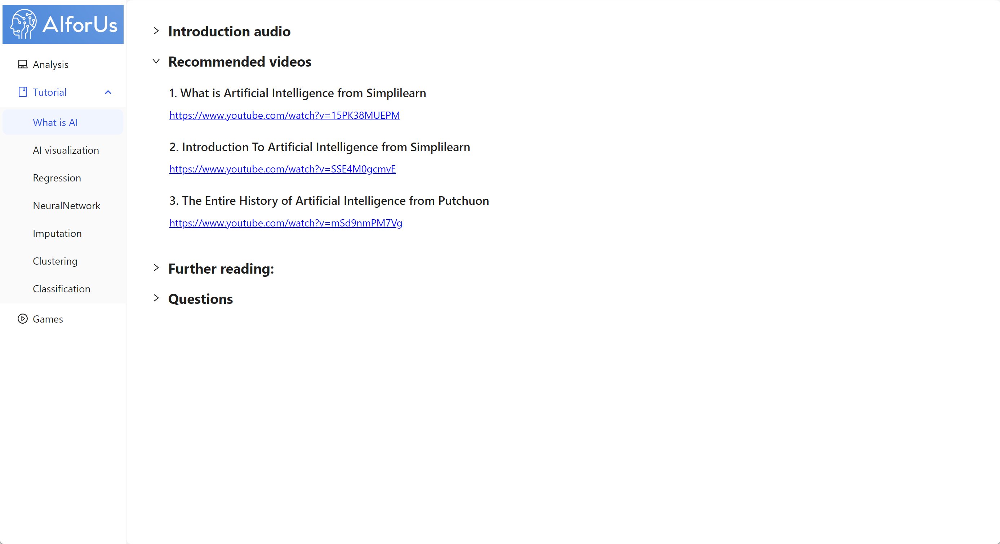
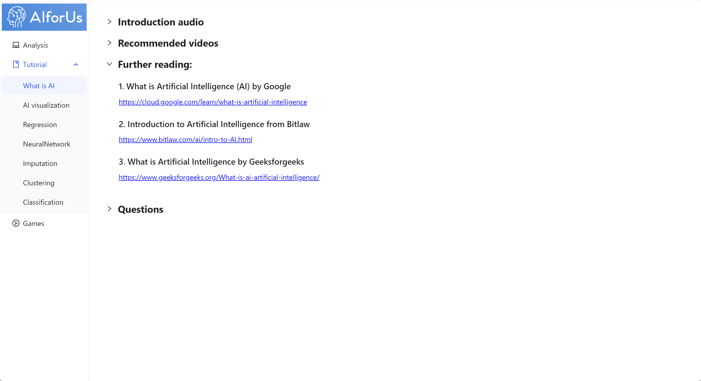

# Educational Resources

We provide exclusive tutorials for our learners. You can find the materials under Tutorial section on the left navigation panel. Our tool currently contains tutorials related to basic concepts within AI field, and will continue to include more topics in the future.

Each concept contains 4 different parts — [Introduction audio](educational-resources.md#introduction-audio), [Recommended videos](educational-resources.md#recommended-videos), [Further reading](educational-resources.md#further-reading) and [Questions](exercise-platform.md#featuring-questions).

## Introduction audio

When exploring a new AI topic, it's essential to start with a solid understanding of the concept. Our _Introduction audio_ provides the perfect starting point—simply click the play button in the image below to dive in through engaging and insightful conversations.

<figure><figcaption>
Introduction audio
</figcaption></figure>

## Recommended videos

Once you have a basic understanding of a new concept, you may want to explore further to build a more comprehensive framework. That’s why we’ve curated a selection of _Recommended videos_ for you. These video links will help solidify your knowledge and provide a strong foundation in the topic.

<figure><figcaption>
Recommended videos
</figcaption></figure>

## Further reading

Once you’ve fully grasped the concept, you may want to dive deeper—that’s where _Further reading_ comes in. These links provide an opportunity for in-depth exploration and deeper insights.

<figure><figcaption>
Further reading
</figcaption></figure>
