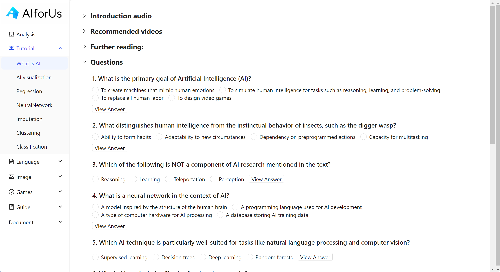
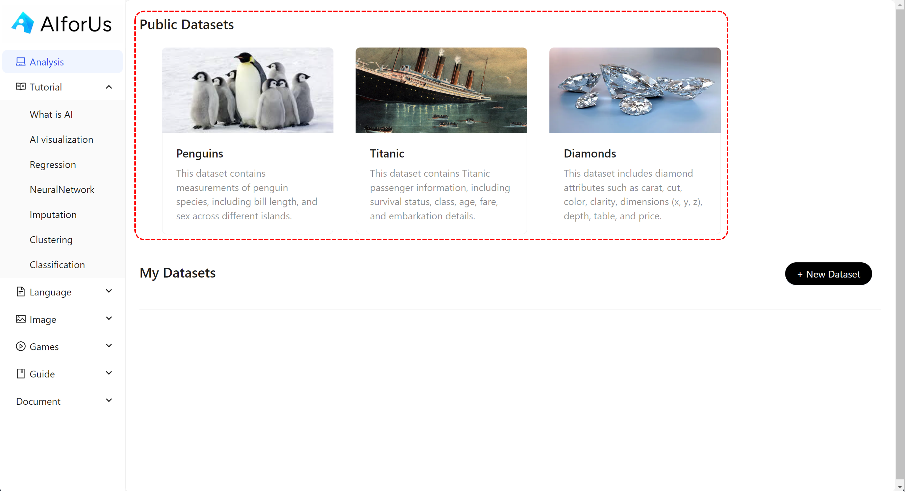

# Exercise Platform

## Featuring questions

Once you've completed the Educational Resources, you may want to test and reinforce your understanding—that’s where the _Exercise Platform_ comes in.

Our tool currently offers a variety of built-in questions to help you assess your knowledge. After completing and submitting all the questions, you'll receive an overall score along with explanations for any incorrect answers.

In future versions, we plan to expand the platform with even more diverse practice opportunities.

<figure><figcaption>
Questions
</figcaption></figure>

## Hands-on Datasets Practice

We provide public datasets under Analysis module, you an use the public dataset to practice the knowledge learned from [Tutorial module](educational-resources.md).

Once click one of the public datasets, you will enter an excel-like page, where you can start to try with various methods through out different steps to get analysis results. You can refer to our [Data Module ](analytics-tool/data-module.md)for more information.

<figure><figcaption>
Public Datasets
</figcaption></figure>
