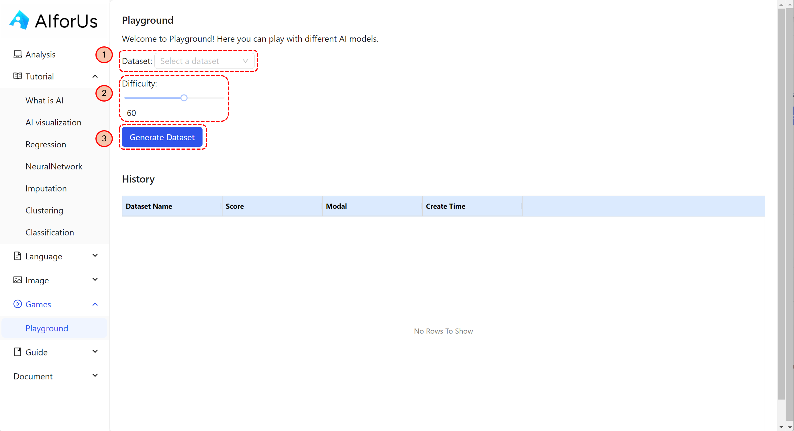

# Game-Based Learning

For better learning after tutorials, we provide game playground for users to consolidate their knowledge.

1. Choose Dataset.
2. Choose Difficulty.
3. Generate Dataset.

Then you will be transferred to the excel-like page, same as [Analytics Tool](analytics-tool/), where you can utilize different techniques to improve the final results. In the end, you will get a score, representing your results accuracy.

<figure><figcaption>
Game playground
</figcaption></figure>
